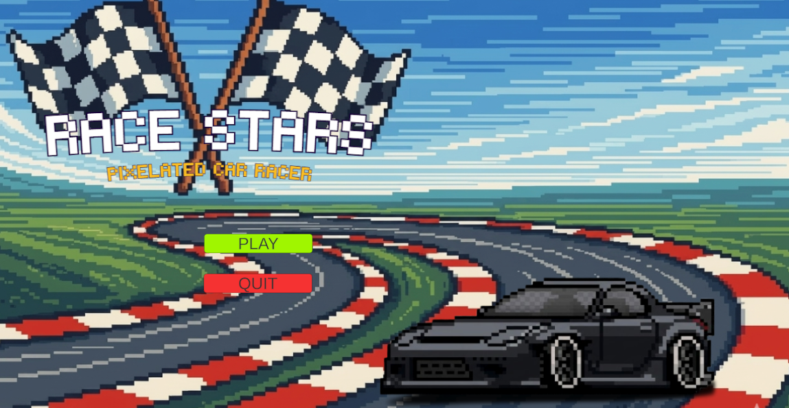
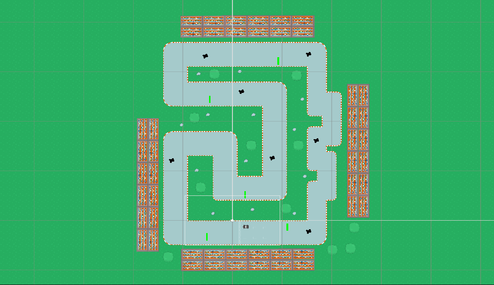

# 🏎️ Race Stars — Pixelated Car Racer

> A top-down pixel art racing game built with Unity as a 2-week final sprint project.

---

## 🎮 Play the Game

👉 **[Play Race Stars on GitHub Pages](https://razee-bot.github.io/RacingGame/)**

---

## 📸 Screenshots

| Main Menu | Gameplay | Finish Screen |
|---|---|---|
|  |  |  |

---

## 🕹️ Controls

| Key | Action |
|---|---|
| `W` / `↑` | Accelerate |
| `S` / `↓` | Brake / Reverse |
| `A` / `←` | Turn Left |
| `D` / `→` | Turn Right |
| Green pads | Boost! |

---

## ✨ Features

- 🏁 Multi-lap race system
- ⚡ Boost zones for speed bursts
- 🐌 Slow zones that reduce speed
- ⏱️ Race timer with best time saving
- 🏆 Leaderboard with personal best tracking
- 🎬 Countdown before race starts
- 📱 Main menu, gameplay, and finish screen

---

## 🛠️ Built With

- **Unity 6** (2D)
- **C#** scripting
- **TextMeshPro** for UI
- **GitHub Pages** for deployment
- Pixel art assets

---

## 👥 Team

| Name | GitHub |
|---|---|
| Student 1 | [@jhonnareinne](https://github.com/jhonnareinne) |
| Student 2 | [@Razee-bot](https://github.com/Razee-bot) |

---

## 📁 Project Structure

```
Assets/
├── Scripts/
│   ├── CarController.cs
│   ├── RaceTimer.cs
│   ├── FinishLine.cs
│   ├── LeaderboardManager.cs
│   ├── MainMenuManager.cs
│   ├── CountdownManager.cs
│   ├── BoostZone.cs
│   └── SlowZone.cs
├── Scenes/
│   ├── MainMenu
│   ├── GameScene
│   ├── FinishScreen
│   └── AboutScene
├── Sprites/
└── Audio/
```

---

*WST Final Project — 2nd Year IT Game Development*
